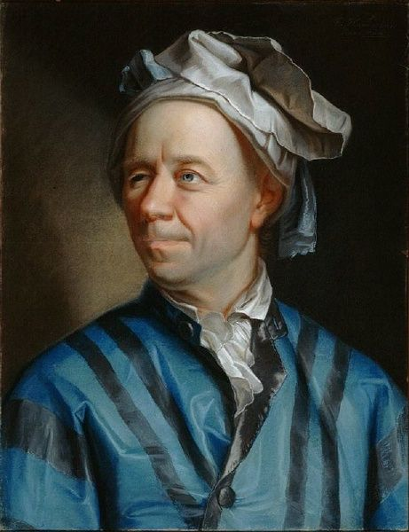

# the-projecteuler100-challenge



[](https://github.com/RichardLitt/standard-readme)

> It's called #ProjectEuler100. And a lot of people have already publicly accepted the challenge.
> The challenge is named after Leonhard Euler, one of the most prolific mathematicians in history.

> https://www.freecodecamp.org/news/projecteuler100-coding-challenge-competitive-programming/

## Table of Contents

- [Install](#install)
- [Usage](#usage)
- [Maintainers](#maintainers)
- [License](#license)

## Install

```
git clone https://github.com/sebastinez/ProjectEuler100.git
```

## Usage

```
npm test
```

## Maintainers

[@sebastinez](https://github.com/sebastinez)

## License

MIT © 2020 Sebastian Martinez
